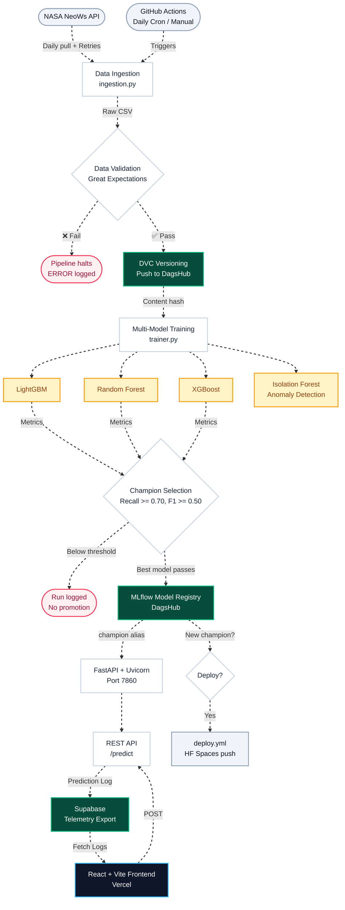

# ☄️ NEO-Sentinel: Autonomous Asteroid Hazard Classification System

> **Production-grade MLOps pipeline for real-time asteroid threat classification using NASA open data, backed by a modern React dashboard.**

[](https://python.org)
[](https://react.dev)
[](https://fastapi.tiangolo.com)
[](https://xgboost.readthedocs.io)
[](https://dagshub.com/Govinthan-KS/Asteroid-Hazard-Classifier)
[](https://supabase.com)
[](https://vercel.com)
[](https://huggingface.co)
[](https://github.com/Govinthan-KS/Asteroid-Hazard-Classifier/actions)

---

## What This System Does

NEO-Sentinel ingests Near-Earth Object (NEO) telemetry from NASA's NeoWs API on a daily schedule with exponential backoff retries. It validates the incoming data, trains a multi-model ensemble (including an Isolation Forest for anomaly detection), promotes the best-performing model to a live production alias, and serves predictions via a REST API. 

The frontend is a beautifully designed, responsive React + Vite application (deployed on Vercel) that provides an interactive prediction interface and a real-time telemetry dashboard backed by Supabase.

**The ML design constraint:** Recall is the primary optimization objective. A missed hazardous asteroid is catastrophically worse than a false alarm. The system only promotes a model to production when all three thresholds are simultaneously satisfied:

| Metric | Current Threshold | Production Target | Rationale |
|--------|------------------|------------------|--------|
| **Recall** | ≥ 0.70 | ≥ 0.90 | Must not miss hazardous objects |
| **F1 Score** | ≥ 0.50 | ≥ 0.85 | Balances precision with high recall |
| **ROC-AUC** | ≥ 0.80 | ≥ 0.92 | Full discriminability across all thresholds |

> **Note:** Thresholds are temporarily relaxed for sparse 30-day rolling datasets (≤ 300 hazardous samples). Production targets above are restored when data volume scales. See `configs/training/training.yaml`.

---

## System Architecture



---

## Pipeline Flow

```
[1] DATA INGESTION     NASA NeoWs API → GitHub Actions → Raw CSV (Exponential Backoff Retries)
        ↓
[2] DATA VALIDATION    Great Expectations → Schema + physical range checks → hard gate
        ↓
[3] DATA VERSIONING    DVC add + push → DagsHub remote (content-hashed, reproducible)
        ↓
[4] MODEL TRAINING     LightGBM/RF/XGBoost (Classification) + IsolationForest (Anomaly Detection)
        ↓
[5] CHAMPION SELECTION Recall >= 0.70, F1 >= 0.50, ROC-AUC >= 0.80 -> @champion alias
        ↓
[6] SERVING            FastAPI → HuggingFace Space
        ↓
[7] FRONTEND           React + Vite + Tailwind CSS UI → Vercel
        ↓
[8] TELEMETRY          FastAPI intercepts requests → Supabase Postgres Database → Dashboard
        ↓
[9] CI/CD              GitHub Actions → daily cron retrain + conditional redeploy
```

---

## Technical Stack

| Layer | Technology | Role |
|-------|-----------|------|
| **Frontend UI** | React, Vite, Tailwind CSS | High-performance glassmorphism interface (Vercel) |
| **ML Models** | XGBoost, LightGBM, Random Forest | Multi-model benchmarking — best wins |
| **Anomaly Detection** | Scikit-Learn `IsolationForest` | Real-time outlier detection (`decision_function`) |
| **Preprocessing** | Scikit-Learn | `ColumnTransformer` + Hybrid SMOTE oversampling |
| **Experiment Tracking** | MLflow on DagsHub | Hyperparameters, metrics, artifacts, model registry |
| **Data Versioning** | DVC → DagsHub | Content-hashed, fully reproducible dataset lineage |
| **Data Validation** | Great Expectations | Physical + structural constraints, hard pipeline gate |
| **REST API** | FastAPI + Uvicorn | `POST /predict` with Pydantic telemetry validation |
| **Telemetry DB** | Supabase | Persistent logging of prediction requests and anomaly scores |
| **Config Management** | Hydra | Zero hardcoding — all values in `configs/*.yaml` |
| **Observability** | Loguru | Structured logs at every pipeline stage |
| **CI/CD** | GitHub Actions | Daily scheduled retrain + conditional redeploy |
| **Container** | Docker (python:3.12-slim) | Single image, HuggingFace Spaces (Backend) |

---

## Model Lineage

The serving layer **dynamically loads the `@champion` model alias** and the `isolation_forest` artifact from the MLflow Model Registry at every container cold start. No model artifact is baked into the image.

```
DagsHub MLflow Registry
└── asteroid-hazard-classifier
    ├── v1  →  Archived
    ├── v2  →  Archived
    └── v3  →  @champion  ← loaded at runtime via mlflow.pyfunc.load_model()
```

**A newly promoted champion model becomes live on the next container restart — no redeployment or image rebuild required.**

Champion selection uses a strict 3-stage process on each training run:
1. **Threshold gate** — all three metrics (recall, F1, ROC-AUC) must clear minimums
2. **Precision guardrail** — eliminates pure "predict-always-hazardous" dummy models
3. **Recall-primary sort** — highest recall wins; F1 is the tie-breaker; newer data wins exact ties

---

## CI/CD Pipeline

Two GitHub Actions workflows run automatically:

### `retrain.yml` — NEO-Sentinel Scheduled Retraining Pipeline
- **Triggers:** Daily at 13:00 IST (07:30 UTC) + manual `workflow_dispatch`
- **Steps:** Ingest → Validate → DVC Version → Train → Detect champion change → Conditional redeploy

### `deploy.yml` — Deploy to HuggingFace Spaces
- **Triggers:** Push to `main` (code changes) + called by `retrain.yml` when a new champion is promoted
- **Action:** Force-pushes `HEAD:main` to the HuggingFace Spaces git remote

*(Note: The React frontend is independently connected to Vercel and deploys instantly on push. The background image is encoded as a Base64 TypeScript file to seamlessly bypass Git LFS constraints across both Vercel and HuggingFace Spaces).*

---

## Repository Structure

```
asteroid-hazard-classifier/
├── frontend/                    # React + Vite UI (Vercel)
│   ├── src/pages/               # Dashboard, Predict, Legal pages
│   ├── src/components/          # Tailwind CSS / Framer Motion components
│   └── src/assets/              # Base64 injected LFS-bypassed images
├── .github/workflows/           # CI/CD pipelines
├── configs/                     # Hydra YAML — zero hardcoding
├── src/asteroid_classifier/
│   ├── core/                    # Config & Exceptions
│   ├── data/                    # Ingestion (w/ Retries), Validation, DVC
│   ├── models/                  # Trainer, IsolationForest, MLFlow Registry
│   └── api/                     # FastAPI Routes, Supabase Telemetry integration
├── docker/                      # HF Spaces Dockerfile
├── data/                        # DVC-tracked — gitignored
├── pyproject.toml               # Poetry dependency manifest
└── .env.example                 # Credential template
```

---

## Local Development

Run the full serving stack locally:

**1. Clone and install:**

```bash
git clone https://github.com/Govinthan-KS/Asteroid-Hazard-Classifier.git
cd Asteroid-Hazard-Classifier
poetry install
cd frontend && npm install && cd ..
```

**2. Create `.env` and `frontend/.env`** (gitignored — never commit):

Check `.env.example` and `frontend/.env.example` for the required keys (NASA API, DagsHub, Supabase).

**3. Run the pipeline locally:**

```bash
# Ingest latest data
poetry run python -m asteroid_classifier.data.ingestion

# Train and promote
poetry run python -m asteroid_classifier.models.trainer

# Serve Backend
PYTHONPATH=src poetry run uvicorn asteroid_classifier.api.main:app --host 0.0.0.0 --port 7860

# Serve Frontend (In a new terminal)
cd frontend && npm run dev
```

---

*Built with 🔭 NASA open data · React & Tailwind · FastAPI · XGBoost · MLflow on DagsHub · Supabase*
